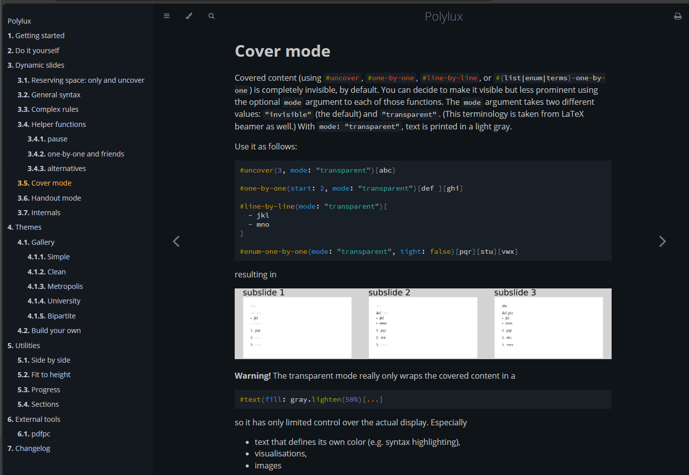

# mdbook-typst-highlight

This is a preprocessor for [mdbook](https://github.com/rust-lang/mdBook) that uses [syntect](https://github.com/trishume/syntect) and [Typst syntax for Sublime Text](https://github.com/hyrious/typst-syntax-highlight/tree/main) to produce&_render_ highlighted Typst code.

Here is an example of output:



## Usage

Install using `cargo`:

```bash
cargo install --git https://github.com/sitandr/mdbook-typst-highlight
```

To add preprocessor to `mdbook`, add this to your `book.toml`:

```toml
[preprocessor.typst-highlight]
```

After it, run `mdbook build` or `serve`. That's it. All inline code and blocks with `typ` will be highlighted.

## Settings

Currently there are only two settings available: 
- Whether to highlight inline blocks (default is yes):

```toml
[preprocessor.typst-highlight]
disable_inline = true
```

- Whether to highlight and render blocks without language specified:

```toml
[preprocessor.typst-highlight]
typst_default = true
```